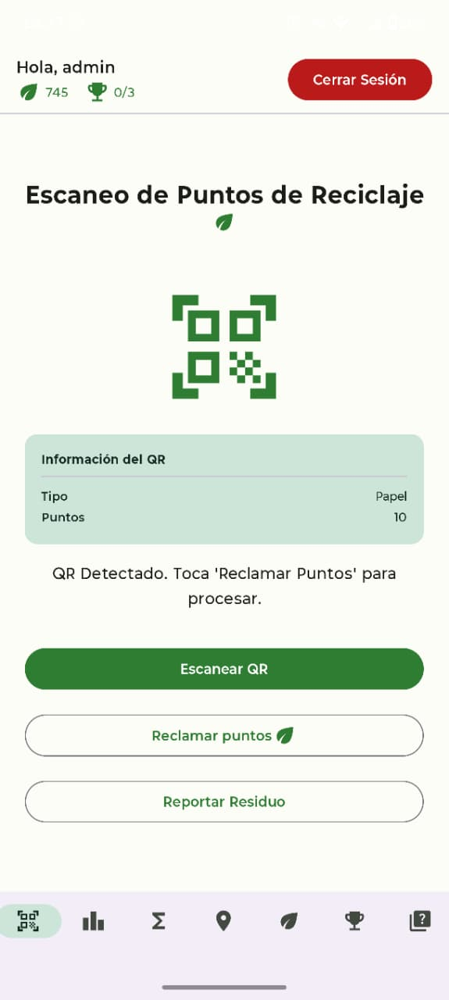
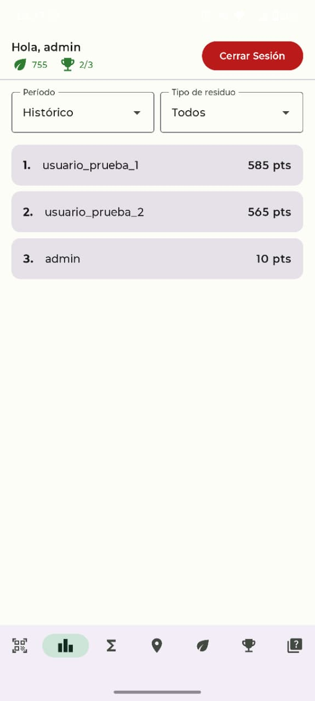
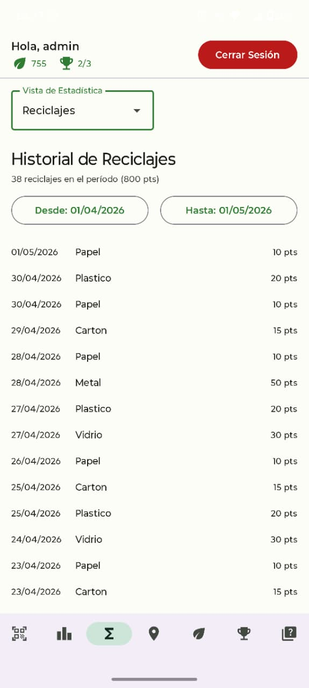
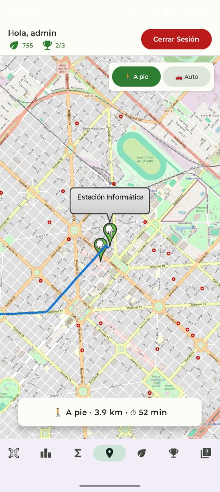
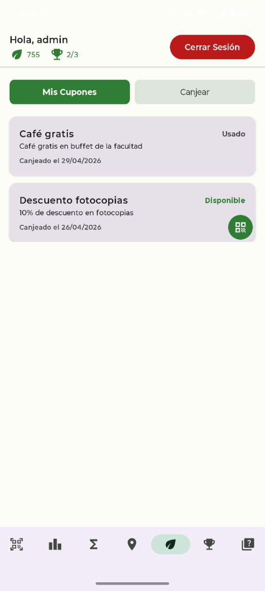
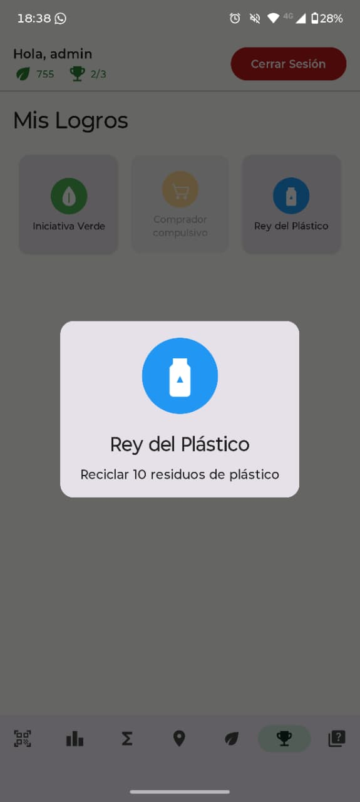
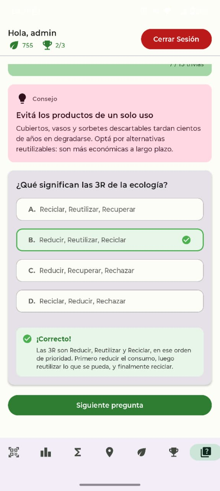

# ♻️ reciclAR

Aplicación móvil para *gamificar* el uso de una Estación de Residuos Inteligente, modernizando el reciclaje en la Universidad.

---

## 🖼️ El contexto

Esta aplicación fue desarrollada como complemento del proyecto "Una estación de residuos inteligente para la facultad", llevado a cabo por compañeros a través de la Secretaría de Extensión de la Facultad de Informática (UNLP).

Dicho proyecto consistió en la implementación de una Estación de Residuos Inteligente que clasifica en categorías los residuos a desechar en un cesto. La clasificación, que sucede mediante una cámara y aplicando técnicas de Aprendizaje Automático, genera un código QR pensado para ser escaneado por una aplicación móvil y para beneficio de quien recicló.

## 🧩 El problema

Fomentar el uso de la Estación de Residuos Inteligente, cuidando el medio ambiente y los espacios de la Facultad.

## 💡 La solución

Una aplicación móvil que *gamifica* el uso de las Estaciones: el usuario adquiere puntos con cada reciclaje para competir con sus compañeros, ganar logros, y canjear cupones que valen por diversos beneficios. A la vez, la aplicación permite recopilar información para generar estadísticas.

---

## 🌟 Características
- Escaneo de QR para reclamo de puntos
  - Envío de reportes por clasificación errónea
- Visualización de ranking semanal e histórico, pudiendo filtrar por tipo de residuo
- Tienda de cupones y generación de QR para su canje
- Geolocalización de Estación de Residuos Inteligente más cercana y cálculo de ruta
- Sección de logros
- Visualización de métricas personales 
  - Reciclajes por tipo de residuos y/o por período de tiempo
  - Historial de reciclajes
  - Historial de canjes
  - Puntos acumulados, puntos gastados y balance neto, por período
- Eco Trivia: apartado de preguntas y respuestas para aprender sobre el reciclaje

---

## 🏗️ Arquitectura

Desarrollada para **Android** y escrita en **Kotlin**, la aplicación sigue el estándar **MVVM** (Model-View-ViewModel) recomendado por Google. La implementación del mismo consiste en una **arquitectura en capas** conformada por la UI Layer (Views y Viewmodels), la Domain Layer (Lógica de negocio, Modelos) y el Data Layer (Repositorios y Data Sources).

## 🌐 Infraestructura

La aplicación consume una API externa que la comunica con un (teórico) servidor principal que centraliza la información de las instancias de esta aplicación y de las Estaciones. El servidor permite el registro de usuarios así como el manejo sus sesiones, valida los reciclajes y devuelve métricas. 

Para fines de demostración y desarrollo local, este entorno remoto está replicado mediante un **contenedor de Docker** provisto por la cátedra.

## 🛠️ Stack tecnológico

| Categoría | Tecnología |
|---|---|
| Entorno de Desarrollo | Android Studio |
| Lenguaje | Kotlin |
| Interfaz de Usuario (UI) | Jetpack Compose |
| Inyección de Dependencias | Dagger Hilt |
| Persistencia Local | Room (SQLite) |
| Cliente de Red (API) | Retrofit, OkHttp |
| Mapas y Geolocalización | osmdroid |
| Servidor para demostración | Docker |

---

## 🚀 Cómo probar la aplicación

Podés probar la aplicación descargando el apk [acá](). 

La otra opción es clonar el repositorio, compilar el código y ejecutarlo. Para este caso se recomienda usar Android Studio ya que facilita mucho la experencia dado el emulador integrado y las facilidades que brinda también para vincular un dispositivo móvil para hacer ejecutar la aplicación nativamente.

También es necesario inicializar el container de Docker que representa al servidor. Para ello: 
1. Descargar la [imagen provista por la cátedra](https://hub.docker.com/r/schavess/estacion_inteligente) o hacer  `docker pull schavess/estacion_inteligente:v1`
2. Ejecutar el container con `docker run -p 8000:8000 schavess/estacion_inteligente:v1`
3. Configurar la URL de la API, desde la pantalla de inicio de sesión de la aplicación (botón en la esquina superior derecha).
  - En caso de emulación, Android Studio tiene una dirección específica para el localhost.
  - Al usar otro dispositivo, la URL consiste en la IP de la computadora donde se está ejecutando el contenedor.
4. Se recomienda iniciar sesión con el par usuario-contraseña: admin, admin
  - A este usuario se le cargaron datos mediante una seed, lo que probar funcionalidades como las visualizaciones de estadísticas o de cupones. 
 
Una vez inicializado, la interfaz web que genera los QR y simula la Estación de Residuos Inteligente se puede encontrar en [http://localhost:8000/](http://localhost:8000/). La documentación completa de la API está en [http://localhost:8000/api/docs/](http://localhost:8000/api/docs/). 

---

## 📸 Capturas

| Reclamación de Puntos | Ranking | Estadísticas |
|:---:|:---:|:---:|
|  |  |  |
| Mapa | Cupones canjeados | Logros |
|  |  |  |
| Trivia | - | - |
|  | - | - |

---

## 🔜 Posibles extensiones

- Evolucionar la gamificación: incluir un juego como núcleo de la aplicación, y/o avatares personalizables
- Complejizar y extender la funcionalidad de trivia
- Permitir al usuario agregar amigos y crear grupos/equipos
- Implementar un modo para administradores
- Incluir una sección de noticias ecológicas, mostrando al usuario el impacto real de sus acciones

---

## 📄 Documentos

- [Informe: Análisis y Diseño](docs/analisis_y_diseño.pdf)
- [Presentación final](docs/presentacion.pdf)

---

## 👤 Autores

**Juan Ignacio Acuña, Arturo Nievas, Facundo Sanchez**  
Trabajo Final — Laboratorio de Software 2025  
Facultad de Informática, UNLP
